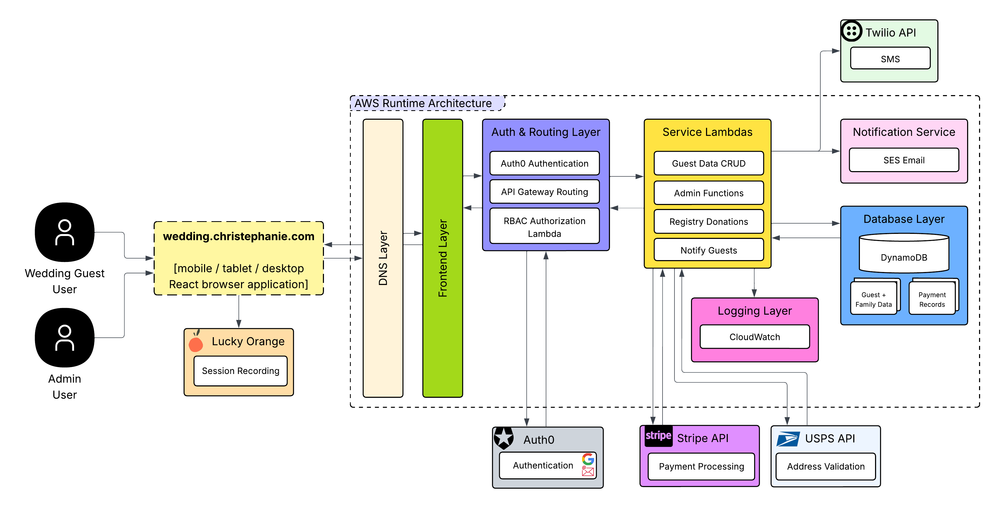
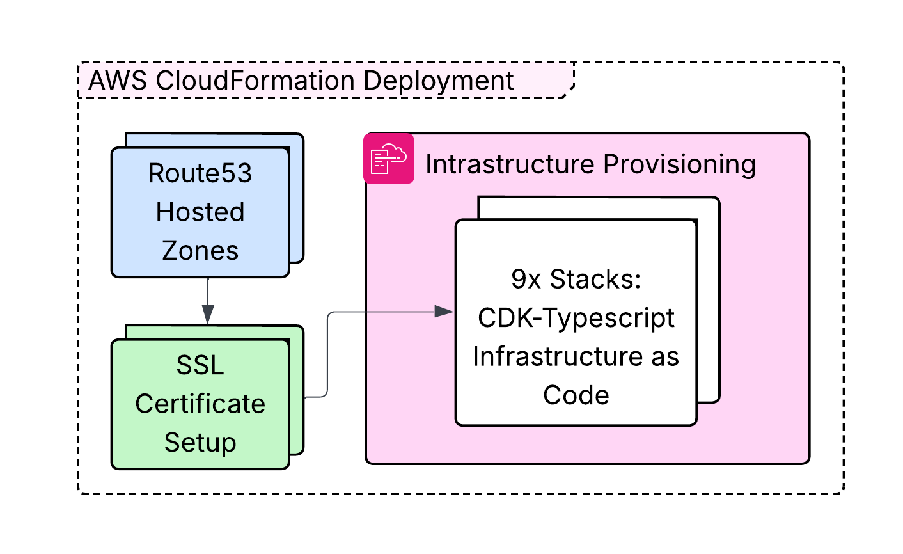
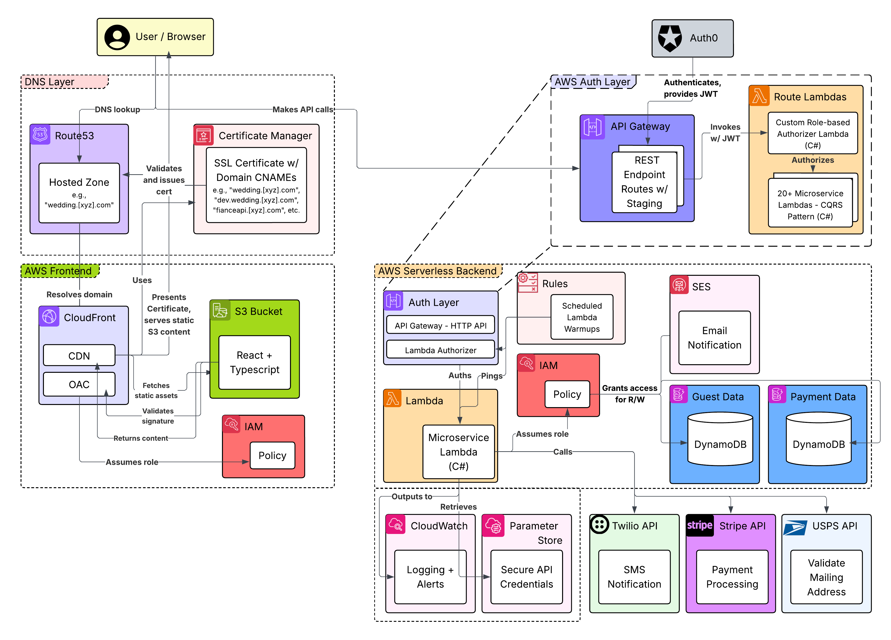
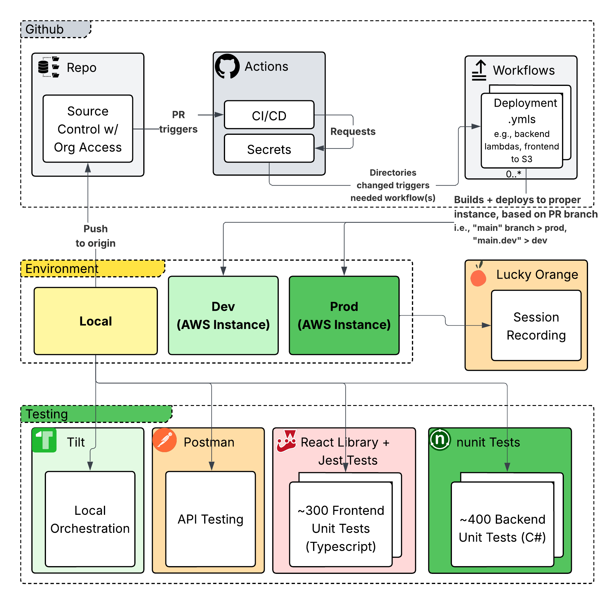

# Architecture Overview

## Summary

While scoping out existing wedding website solutions for our own July 2025 celebration, my husband and I found most sites on the market
were built on generic design templates, sluggish, and lacked overall in spirit. We could build our own system, we decided, with more oomph
than "custom CSS" textboxes could provide!

This documentation provides comprehensive architectural insights into our custom "Christephanie" wedding management system.
My husband (frontend engineer) and I built this system to manage our wedding planning, guest RSVPs, and related logistics.
In addition to unique design: security, privacy, and availability were my top concerns, as we wanted to ensure our guests' data was
protected while providing a seamless user experience. I designed the system to be scalable, maintainable, and ready for potential future expansion into a
multi-tenanted SaaS platform.

### Project Context & Constraints
- **Critical Timeline**: Dec 2024 project start → July 2025 wedding
- **Key Milestones**: Save-the-dates by March 2025, Printed Invitations out by April 2025, and RSVPs due by May 18, 2025
- **Functional Requirements**: Guest management, RSVP system, custom invitation generation, wedding details, stats dashboard, registry, admin functionality
- **Future Vision**: Multi-tenant SaaS expansion capability
- **Team**: My husband (design and frontend) and I (infrastructure, architecture, RBAC auth, backend, CI/CD)

---

## High-Level System Architecture

---

## Table of Contents

| # | Document | Description |
|---|----------|-------------|
| 1 | [System Overview](./system-overview.md) | High-level architecture diagrams showing component interactions and data flow |
| 2 | [Design Decisions & Architecture Rationale](./design-decisions.md) | Detailed architectural decisions, technical constraints, and engineering practices |
| 3 | [AWS Infrastructure Architecture](./aws-infrastructure.md) | AWS services deployment, CDK stack dependencies, and environment separation |
| 4 | [Frontend Architecture](./frontend-architecture.md) | React application structure, component hierarchy, state management, and responsive design |
| 5 | [Backend Architecture](./backend-architecture.md) | Lambda function organization, CQRS pattern, data access layer, and external integrations |
| 6 | [Data Flow Diagrams](./data-flow.md) | User journey flows, admin workflows, payment processing, and real-time synchronization |
| 7 | [Deployment Architecture](./deployment-architecture.md) | CI/CD pipeline, environment management, monitoring, and disaster recovery strategies |
| 8 | [Resume Highlights](./resume-highlights.md) | Key technical achievements and project metrics |

---

## System Overview
- **Technology Stack**: React + TypeScript frontend, C# Lambda backend, AWS infrastructure
- **Architecture Pattern**: Serverless microservices with CQRS
- **Database**: DynamoDB with optimized indexes
- **Authentication**: Auth0 with JWT tokens
- **Payments**: Stripe integration
- **Infrastructure**: AWS CDK Infrastructure as Code
- **Repository & Deployment**: Github workflow Actions for CI/CD
- **Local Env**: Tilt for local orchestration, Swagger and Postman for API testing
- **Testing**: Jest for frontend, nunit for backend
- **Monitoring**: CloudWatch and Lucky Orange session recording (for usage improvements)

## Key Metrics
- **Lambda Functions**: 25+ specialized microservices
- **Authorizing Function**: Lambda for JWT validation and RBAC authorization
- **Admin Functions**: Family management, configuration, setup
- **API Endpoints**: 30+ RESTful endpoints
- **Database Tables**: 4 main tables with GSI indexes
- **Frontend Components**: 50+ React components
- **Test Coverage**: 80%+ unit test coverage (300+ frontend tests, 400+ backend tests)
- **Performance**: <200ms API response times

## Features
- Multi-step RSVP form with real-time validation
- Save-the-date interest phase to collect guest availability
- Invitation generation with custom print design and addressing
- Gift registry with Stripe payment processing
- Admin dashboard for secure family management
- Statistics dashboard for anonymized guest attendance and preference data
- Mobile-first responsive design
- PWA capabilities for offline and device-agnostic access
- Opt-in email and SMS campaigns for wedding updates
- Comprehensive monitoring with CloudWatch

## Architecture Benefits
- **Scalability**: Auto-scaling serverless infrastructure
- **Reliability**: Multi-AZ deployment with 99.9% uptime
- **Security**: Unique family codes, JWT authentication with role-based access
- **Performance**: Edge-cached content delivery, function cold start optimizations
- **Maintainability**: Clean separation of concerns
- **Cost-Effective**: Pay-per-use serverless model

---

## High-Level Architecture

The Christephanie wedding system follows a modern serverless architecture with clear separation between frontend, API, and data layers.

### Core Components

**Frontend Layer**
- React 18 SPA with TypeScript
- Material-UI component library
- Recoil state management
- TanStack Query for server state
- Deployed via CloudFront + S3

**API Layer**
- AWS API Gateway HTTP API
- Lambda authorizer for JWT validation
- 25+ specialized Lambda functions
- RESTful API design

**Data Layer**
- DynamoDB for primary data storage
- S3 for file storage and static assets
- Parameter Store for configuration
- CloudWatch for logging and metrics

**External Integrations**
- Auth0 for authentication
- Stripe for payment processing
- Amazon SES for email delivery
- Twilio for SMS notifications
- USPS API for address validation

### Request Flow

1. **User Access**: Users access the React SPA via CloudFront CDN
2. **Authentication**: Auth0 provides JWT tokens for API access
3. **API Requests**: Frontend makes requests to API Gateway
4. **Authorization**: Lambda authorizer validates JWT tokens
5. **Business Logic**: Appropriate Lambda function processes the request
6. **Data Access**: Lambda functions interact with DynamoDB
7. **Response**: JSON responses returned to frontend
8. **UI Update**: React components update based on response

### Deployment Architecture

**Development Environment**
- dev.Christephanie.com
- Full feature testing
- Integration validation

**Production Environment**
- Christephanie.com
- Live wedding system
- Performance monitoring

### Key Design Principles

- **Serverless-First**: Minimize operational overhead
- **Microservices**: Small, focused Lambda functions
- **API-First**: RESTful design with clear contracts
- **Mobile-First**: Responsive design for all devices
- **Security-First**: JWT authentication with RBAC
- **Performance-First**: Edge caching and optimization

---

## Related Links

- [Live Application](https://Christephanie.com)
- [Development Environment](https://dev.Christephanie.com)

---

**Last Updated**: March 2026
**Document Version**: 2.0
