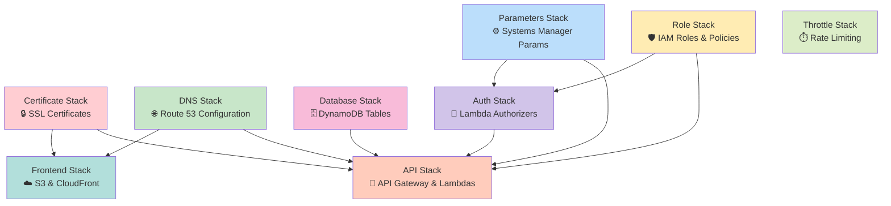
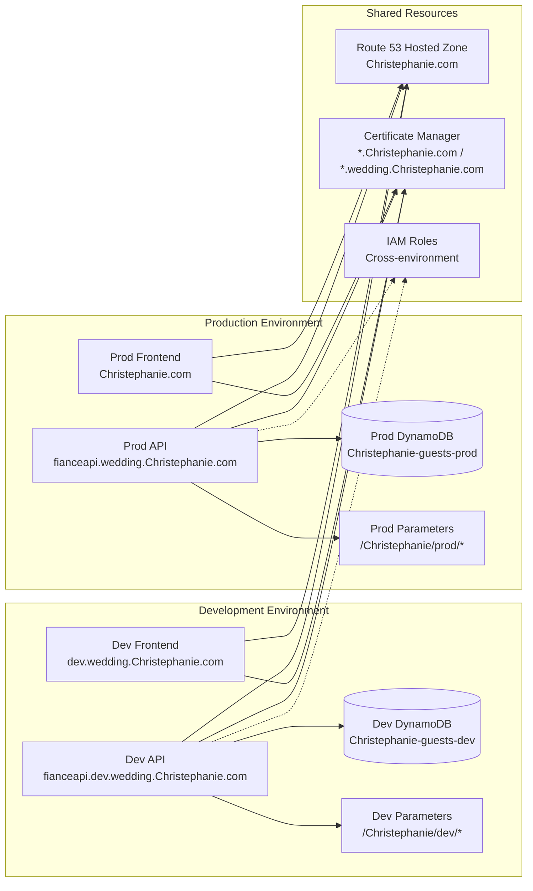

# AWS Infrastructure Architecture

## AWS Services Deployment Architecture

```mermaid
graph TB
    subgraph "Route 53 DNS"
        DNS[🌐 Christephanie.com<br/>Hosted Zone]
        DevDNS[🌐 dev.wedding.Christephanie.com]
        ProdDNS[🌐 wedding.christephanie.com]
    end
    
    subgraph "Certificate Manager"
        DevCert[🔒 Dev SSL Certificate]
        ProdCert[🔒 Prod SSL Certificate]
    end
    
    subgraph "CloudFront CDN"
        DevCF[☁️ Dev Distribution<br/>Edge Locations]
        ProdCF[☁️ Prod Distribution<br/>Edge Locations]
    end
    
    subgraph "S3 Static Hosting"
        DevS3[🪣 Dev Frontend Bucket<br/>www.dev.wedding.Christephanie.com]
        ProdS3[🪣 Prod Frontend Bucket<br/>www.wedding.Christephanie.com]
        SetupS3[🪣 Setup Data Bucket<br/>Admin Uploads]
    end
    
    subgraph "API Gateway"
        DevAPIGW[🚪 Dev HTTP API<br/>fianceapi.dev.wedding.Christephanie.com]
        ProdAPIGW[🚪 Prod HTTP API<br/>fianceapi.wedding.Christephanie.com]
    end
    
    subgraph "Lambda Functions - Admin"
        AdminAuth[🔑 Authorization Lambda]
        AdminFamilyCreate[👨‍💼 Family Create]
        AdminFamilyUpdate[👨‍💼 Family Update]
        AdminFamilyDelete[👨‍💼 Family Delete]
        AdminFamilyGet[👨‍💼 Family Get]
        AdminConfig[⚙️ Configuration]
        AdminSetup[🔧 Setup]
    end
    
    subgraph "Lambda Functions - Guest"
        GuestFamilyGet[👤 Guest Family Get]
        GuestFamilyUpdate[👤 Guest Family Update]
        GuestFamilyPatch[👤 Guest Family Patch]
        GuestPatch[👤 Guest Patch]
        GuestMasked[🔍 Masked Values Get]
    end
    
    subgraph "Lambda Functions - Payments"
        PaymentIntent[💳 Payment Intent]
        PaymentConfirm[✅ Payment Confirm]
        PaymentContrib[🎁 Contributions]
    end
    
    subgraph "Lambda Functions - Validation"
        ValidateAddress[📮 Address Validation]
        ValidateEmail[📧 Email Validation]
        ValidatePhone[📱 Phone Validation]
        VerifyEmail[✉️ Email Verification]
    end
    
    subgraph "Lambda Functions - Utility"
        HealthCheck[❤️ Health Check]
        Stats[📊 Statistics]
        EmailNotify[📧 Email Notifications]
        UserFind[🔍 User Find]
        UserGet[👤 User Get]
        UserPatch[👤 User Patch]
    end
    
    subgraph "DynamoDB Tables"
        GuestTable[(👥 Guests Table<br/>PartitionKey: FamilyUnit<br/>SortKey: GuestId<br/>GSI: GuestIdIndex)]
        DesignTable[(🎨 Design Configuration<br/>PartitionKey: ConfigType<br/>SortKey: ConfigId)]
        PaymentTable[(💰 Payment Intents<br/>PartitionKey: PaymentId<br/>SortKey: Timestamp)]
        EmailTable[(📧 Email Tracking<br/>PartitionKey: CampaignId<br/>SortKey: GuestId)]
    end
    
    subgraph "IAM Security"
        LambdaRole[🛡️ Lambda Execution Roles]
        APIGWRole[🛡️ API Gateway Role]
        DynamoRole[🛡️ DynamoDB Access Roles]
    end
    
    subgraph "Systems Manager"
        DevParams[⚙️ Dev Parameters<br/>- Auth0 Config<br/>- Stripe Keys<br/>- API URLs]
        ProdParams[⚙️ Prod Parameters<br/>- Auth0 Config<br/>- Stripe Keys<br/>- API URLs]
    end
    
    subgraph "CloudWatch"
        Logs[📊 Lambda Logs]
        Metrics[📈 Performance Metrics]
        Alarms[🚨 CloudWatch Alarms]
    end
    
    DNS --> DevDNS
    DNS --> ProdDNS
    DevDNS --> DevCert
    ProdDNS --> ProdCert
    
    DevCert --> DevCF
    ProdCert --> ProdCF
    DevCF --> DevS3
    ProdCF --> ProdS3
    
    DevDNS --> DevAPIGW
    ProdDNS --> ProdAPIGW
    
    DevAPIGW --> AdminAuth
    ProdAPIGW --> AdminAuth
    
    AdminAuth --> AdminFamilyCreate
    AdminAuth --> AdminFamilyUpdate
    AdminAuth --> AdminFamilyDelete
    AdminAuth --> AdminFamilyGet
    AdminAuth --> AdminConfig
    AdminAuth --> AdminSetup
    
    AdminAuth --> GuestFamilyGet
    AdminAuth --> GuestFamilyUpdate
    AdminAuth --> GuestFamilyPatch
    AdminAuth --> GuestPatch
    AdminAuth --> GuestMasked
    
    AdminAuth --> PaymentIntent
    AdminAuth --> PaymentConfirm
    AdminAuth --> PaymentContrib
    
    AdminAuth --> ValidateAddress
    AdminAuth --> ValidateEmail
    AdminAuth --> ValidatePhone
    AdminAuth --> VerifyEmail
    
    AdminAuth --> HealthCheck
    AdminAuth --> Stats
    AdminAuth --> EmailNotify
    AdminAuth --> UserFind
    AdminAuth --> UserGet
    AdminAuth --> UserPatch
    
    AdminFamilyCreate --> GuestTable
    AdminFamilyUpdate --> GuestTable
    AdminFamilyDelete --> GuestTable
    AdminFamilyGet --> GuestTable
    AdminConfig --> DesignTable
    AdminSetup --> GuestTable
    AdminSetup --> SetupS3
    
    GuestFamilyGet --> GuestTable
    GuestFamilyUpdate --> GuestTable
    GuestFamilyPatch --> GuestTable
    GuestPatch --> GuestTable
    GuestMasked --> GuestTable
    
    PaymentIntent --> PaymentTable
    PaymentConfirm --> PaymentTable
    PaymentContrib --> PaymentTable
    
    EmailNotify --> EmailTable
    Stats --> GuestTable
    Stats --> PaymentTable
    UserFind --> GuestTable
    UserGet --> GuestTable
    UserPatch --> GuestTable
    
    AdminAuth --> DevParams
    AdminAuth --> ProdParams
    
    AdminFamilyCreate -.-> LambdaRole
    AdminFamilyUpdate -.-> LambdaRole
    AdminFamilyDelete -.-> LambdaRole
    GuestFamilyGet -.-> LambdaRole
    PaymentIntent -.-> LambdaRole
    ValidateAddress -.-> LambdaRole
    
    DevAPIGW -.-> APIGWRole
    ProdAPIGW -.-> APIGWRole
    GuestTable -.-> DynamoRole
    DesignTable -.-> DynamoRole
    PaymentTable -.-> DynamoRole
    EmailTable -.-> DynamoRole
    
    AdminFamilyCreate --> Logs
    GuestFamilyGet --> Logs
    PaymentIntent --> Logs
    ValidateAddress --> Logs
    
    Logs --> Metrics
    Metrics --> Alarms
```

## CDK Stack Dependencies

```mermaid
graph TD
    CertStack[Certificate Stack<br/>🔒 SSL Certificates]
    DNSStack[DNS Stack<br/>🌐 Route 53 Configuration]
    ParamsStack[Parameters Stack<br/>⚙️ Systems Manager Params]
    DatabaseStack[Database Stack<br/>🗄️ DynamoDB Tables]
    RoleStack[Role Stack<br/>🛡️ IAM Roles & Policies]
    AuthStack[Auth Stack<br/>🔑 Lambda Authorizers]
    APIStack[API Stack<br/>🚪 API Gateway & Lambdas]
    FrontendStack[Frontend Stack<br/>☁️ S3 & CloudFront]
    ThrottleStack[Throttle Stack<br/>⏱️ Rate Limiting]
    
    CertStack --> FrontendStack
    CertStack --> APIStack
    DNSStack --> FrontendStack
    DNSStack --> APIStack
    ParamsStack --> AuthStack
    ParamsStack --> APIStack
    DatabaseStack --> APIStack
    RoleStack --> AuthStack
    RoleStack --> APIStack
    AuthStack --> APIStack
    
    classDef certClass fill:#ffcdd2
    classDef dnsClass fill:#c8e6c9
    classDef paramsClass fill:#bbdefb
    classDef dbClass fill:#f8bbd9
    classDef roleClass fill:#ffecb3
    classDef authClass fill:#d1c4e9
    classDef apiClass fill:#ffccbc
    classDef frontendClass fill:#b2dfdb
    classDef throttleClass fill:#dcedc8
    
    class CertStack certClass
    class DNSStack dnsClass
    class ParamsStack paramsClass
    class DatabaseStack dbClass
    class RoleStack roleClass
    class AuthStack authClass
    class APIStack apiClass
    class FrontendStack frontendClass
    class ThrottleStack throttleClass
```

## Environment Separation

```mermaid
graph LR
    subgraph "Development Environment"
        DevFE[Dev Frontend<br/>dev.wedding.Christephanie.com]
        DevAPI[Dev API<br/>fianceapi.dev.wedding.Christephanie.com]
        DevDB[(Dev DynamoDB<br/>Christephanie-guests-dev)]
        DevParams[Dev Parameters<br/>/Christephanie/dev/*]
    end
    
    subgraph "Production Environment"  
        ProdFE[Prod Frontend<br/>Christephanie.com]
        ProdAPI[Prod API<br/>fianceapi.wedding.Christephanie.com]
        ProdDB[(Prod DynamoDB<br/>Christephanie-guests-prod)]
        ProdParams[Prod Parameters<br/>/Christephanie/prod/*]
    end
    
    subgraph "Shared Resources"
        Route53[Route 53 Hosted Zone<br/>Christephanie.com]
        ACM[Certificate Manager<br/>*.Christephanie.com / *.wedding.Christephanie.com]
        IAMRoles[IAM Roles<br/>Cross-environment]
    end
    
    DevFE --> Route53
    DevAPI --> Route53
    ProdFE --> Route53
    ProdAPI --> Route53
    
    DevFE --> ACM
    DevAPI --> ACM
    ProdFE --> ACM
    ProdAPI --> ACM
    
    DevAPI --> DevDB
    DevAPI --> DevParams
    ProdAPI --> ProdDB
    ProdAPI --> ProdParams
    
    DevAPI -.-> IAMRoles
    ProdAPI -.-> IAMRoles
```