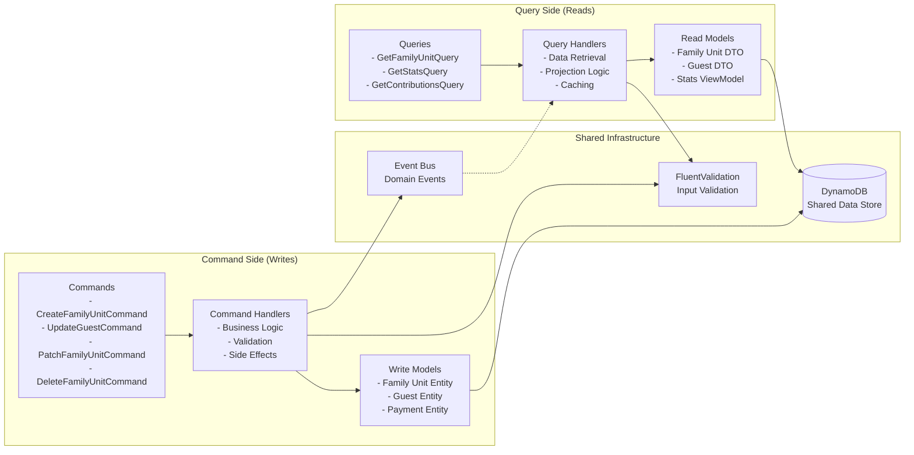
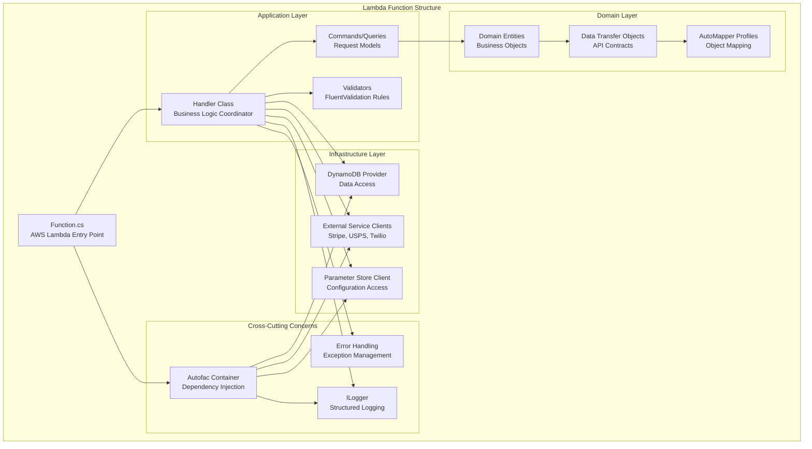
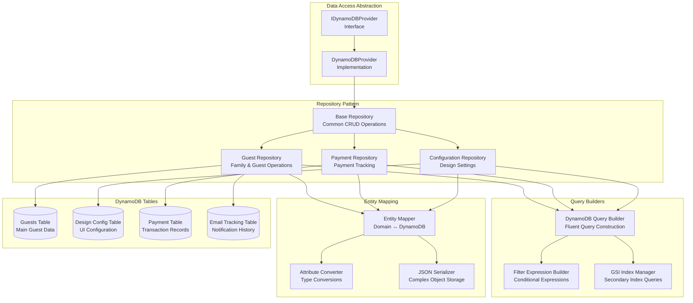
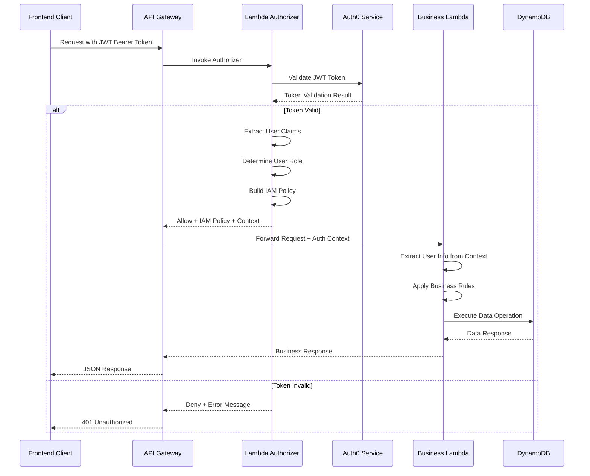
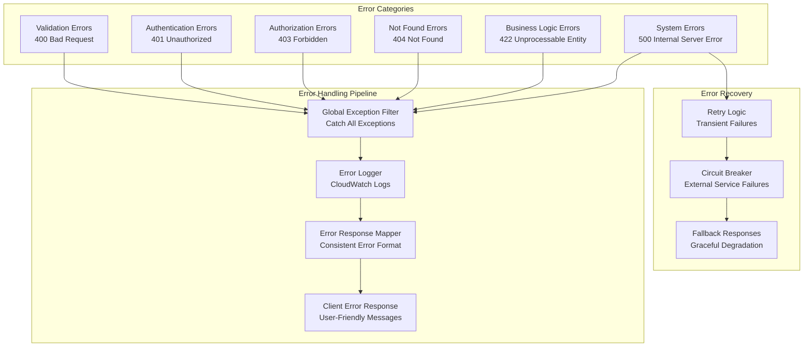
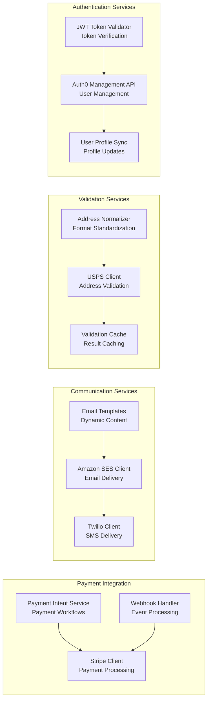

# Backend Architecture

## Lambda Function Organization

```mermaid
graph TB
    subgraph "API Gateway Entry Point"
        APIGW[🚪 HTTP API Gateway<br/>Single Entry Point]
        Auth[🔑 Lambda Authorizer<br/>JWT Validation]
    end
    
    subgraph "Admin Domain Lambdas"
        AdminFamilyCreate[👨‍💼 Admin.FamilyUnit.Create<br/>Family Creation Logic]
        AdminFamilyUpdate[👨‍💼 Admin.FamilyUnit.Update<br/>Family Modification Logic]
        AdminFamilyDelete[👨‍💼 Admin.FamilyUnit.Delete<br/>Family Removal Logic]
        AdminFamilyGet[👨‍💼 Admin.FamilyUnit.Get<br/>Family Retrieval Logic]
        AdminConfig[⚙️ Admin.Configuration.Invitation<br/>Design & Photo Management]
        AdminSetup[🔧 Admin.Setup<br/>Initial System Setup]
    end
    
    subgraph "Guest Domain Lambdas"
        GuestFamilyGet[👤 FamilyUnit.Get<br/>Guest Family Retrieval]
        GuestFamilyUpdate[👤 FamilyUnit.Update<br/>Family Information Updates]
        GuestFamilyPatch[👤 FamilyUnit.Patch<br/>Partial Family Updates]
        GuestPatch[👤 Guest.Patch<br/>Individual Guest Updates]
        GuestMasked[🔍 Guest.MaskedValues.Get<br/>Privacy-Protected Data]
    end
    
    subgraph "Payment Domain Lambdas"
        PaymentIntent[💳 Payments.Intent<br/>Stripe Payment Creation]
        PaymentConfirm[✅ Payments.Intent.Confirm<br/>Webhook Processing]
        PaymentContrib[🎁 Payments.Contributions<br/>Gift Contribution Tracking]
    end
    
    subgraph "Validation Domain Lambdas"
        ValidateAddress[📮 Validate.Address<br/>USPS Address Validation]
        ValidateEmail[📧 Validate.Email<br/>Email Format & Existence]
        ValidatePhone[📱 Validate.Phone<br/>Phone Number Validation]
        VerifyEmail[✉️ Verify.Email<br/>Email Verification Flow]
    end
    
    subgraph "Utility Domain Lambdas"
        Health[❤️ Health<br/>System Health Checks]
        Stats[📊 Stats.Get<br/>Analytics & Reporting]
        EmailNotify[📧 Notify.Email<br/>Email Campaign Management]
        UserFind[🔍 User.Find<br/>User Discovery]
        UserGet[👤 User.Get<br/>User Data Retrieval]
        UserPatch[👤 User.Patch<br/>User Profile Updates]
    end
    
    APIGW --> Auth
    Auth --> AdminFamilyCreate
    Auth --> AdminFamilyUpdate
    Auth --> AdminFamilyDelete
    Auth --> AdminFamilyGet
    Auth --> AdminConfig
    Auth --> AdminSetup
    
    Auth --> GuestFamilyGet
    Auth --> GuestFamilyUpdate
    Auth --> GuestFamilyPatch
    Auth --> GuestPatch
    Auth --> GuestMasked
    
    Auth --> PaymentIntent
    Auth --> PaymentConfirm
    Auth --> PaymentContrib
    
    Auth --> ValidateAddress
    Auth --> ValidateEmail
    Auth --> ValidatePhone
    Auth --> VerifyEmail
    
    Auth --> Health
    Auth --> Stats
    Auth --> EmailNotify
    Auth --> UserFind
    Auth --> UserGet
    Auth --> UserPatch
    
    classDef adminClass fill:#ffcdd2
    classDef guestClass fill:#c8e6c9
    classDef paymentClass fill:#bbdefb
    classDef validationClass fill:#f8bbd9
    classDef utilityClass fill:#ffecb3
    classDef gatewayClass fill:#d1c4e9
    
    class AdminFamilyCreate,AdminFamilyUpdate,AdminFamilyDelete,AdminFamilyGet,AdminConfig,AdminSetup adminClass
    class GuestFamilyGet,GuestFamilyUpdate,GuestFamilyPatch,GuestPatch,GuestMasked guestClass
    class PaymentIntent,PaymentConfirm,PaymentContrib paymentClass
    class ValidateAddress,ValidateEmail,ValidatePhone,VerifyEmail validationClass
    class Health,Stats,EmailNotify,UserFind,UserGet,UserPatch utilityClass
    class APIGW,Auth gatewayClass
```

## CQRS Pattern Implementation

## Lambda Function Internal Architecture

## Data Access Layer Architecture

## Authentication & Authorization Flow

## Error Handling Strategy

## External Service Integration

