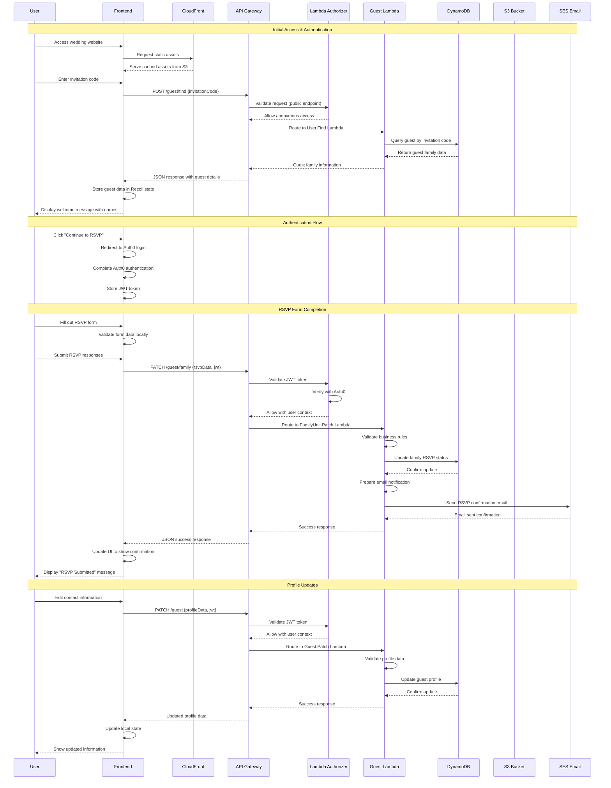
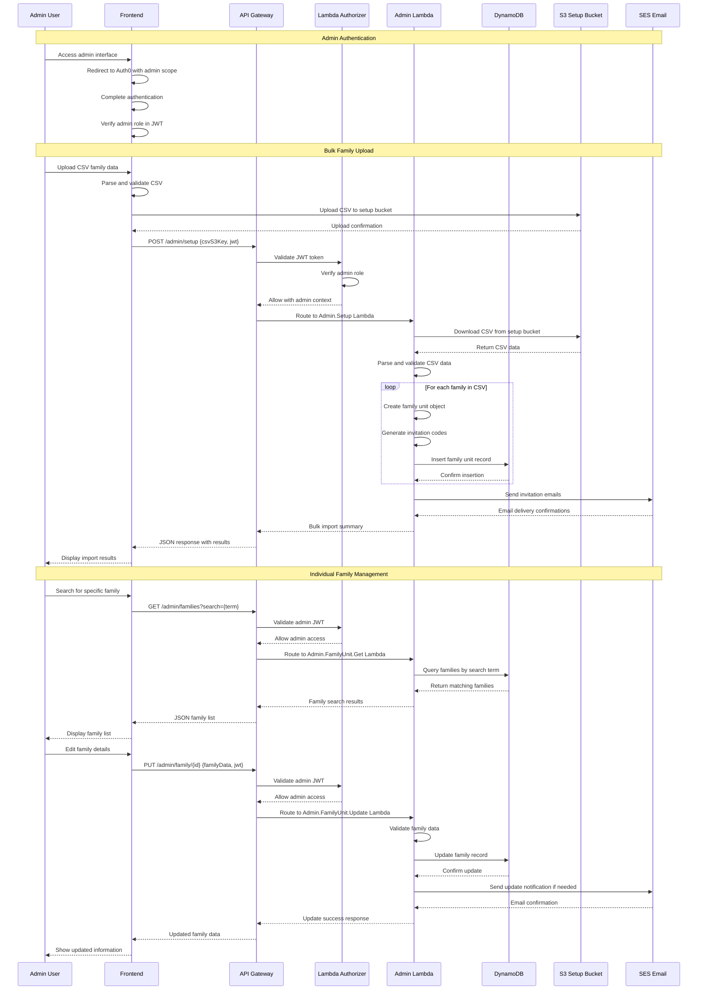
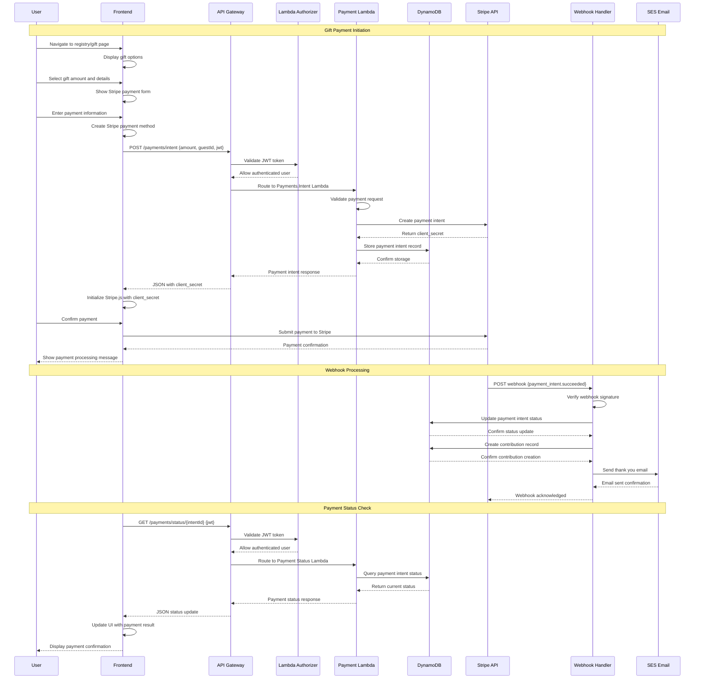
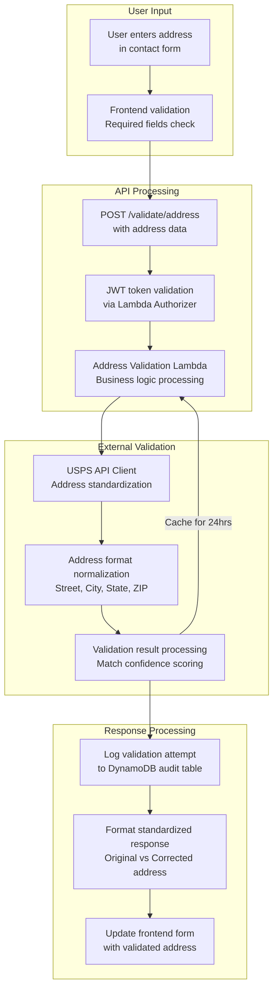
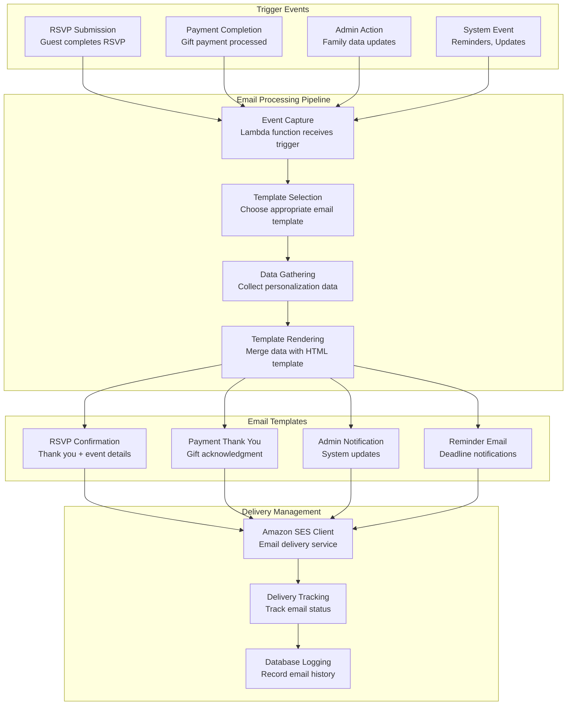
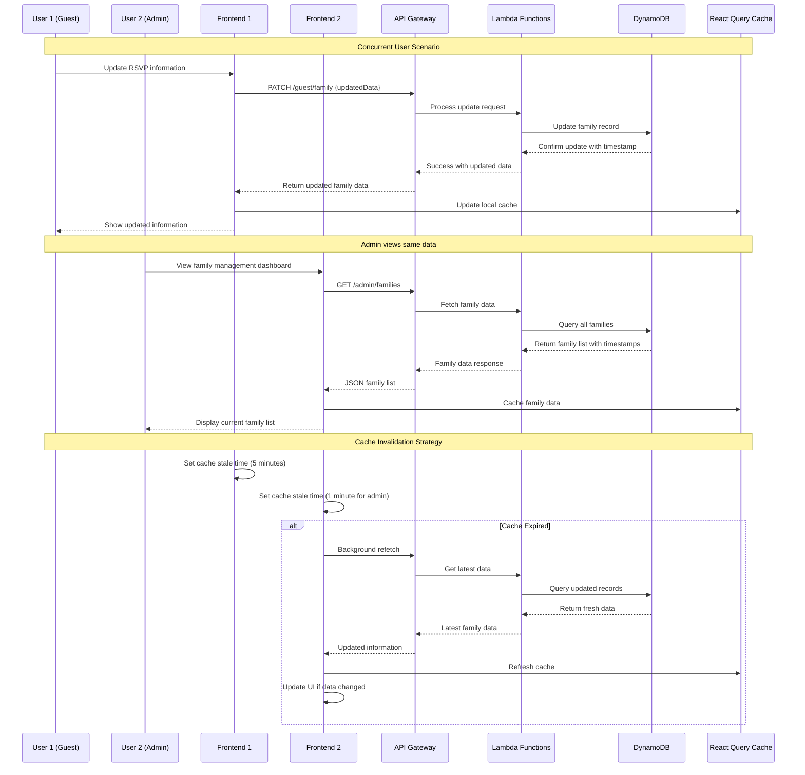

# Data Flow Diagrams

## RSVP User Journey Data Flow

## Admin Family Management Data Flow

## Payment Processing Data Flow

## Address Validation Data Flow

## Email Notification Data Flow

## Real-time Data Synchronization

