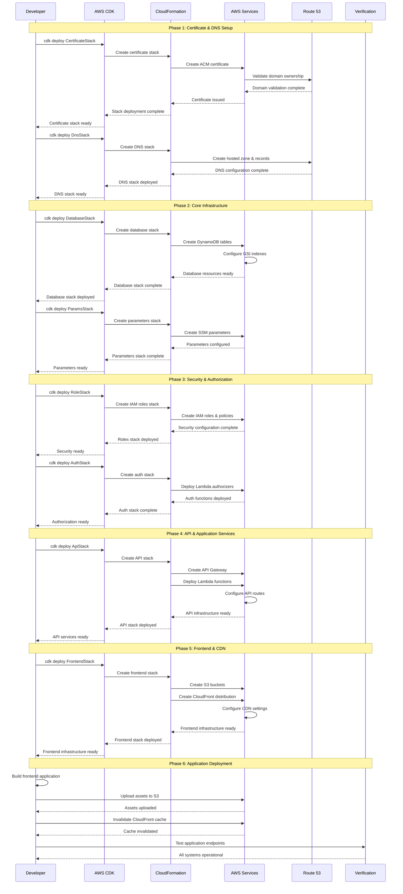
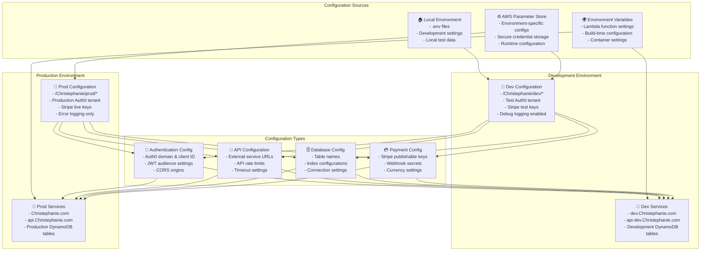
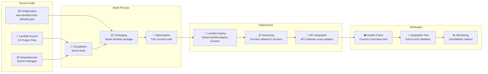
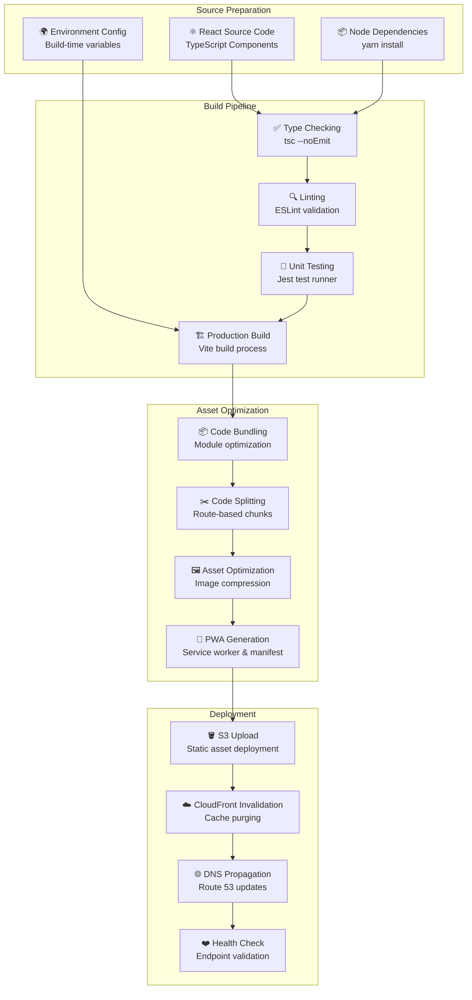
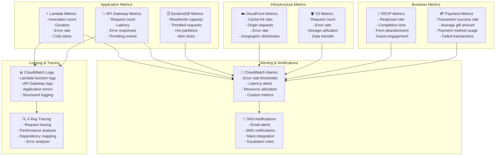
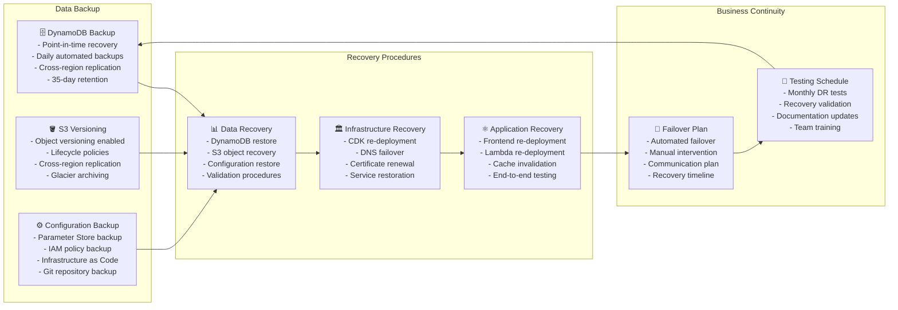

# Deployment Architecture

## CI/CD Pipeline & Deployment Strategy

```mermaid
graph TD
    subgraph "Development Workflow"
        DevLocal[👨‍💻 Local Development<br/>- yarn dev (frontend)<br/>- dotnet build (backend)<br/>- cdk deploy (infra)]
        Git[📚 Git Repository<br/>- Feature branches<br/>- Pull requests<br/>- Code reviews]
        Testing[🧪 Local Testing<br/>- yarn test:unit<br/>- dotnet test<br/>- End-to-end tests]
    end
    
    subgraph "Build Process"
        FrontendBuild[⚛️ Frontend Build<br/>- TypeScript compilation<br/>- Vite bundling<br/>- Asset optimization]
        BackendBuild[🏗️ Backend Build<br/>- .NET compilation<br/>- Lambda packaging<br/>- Dependency resolution]
        InfraBuild[🏛️ Infrastructure Build<br/>- CDK synthesis<br/>- CloudFormation templates<br/>- Resource validation]
    end
    
    subgraph "Deployment Environments"
        DevEnv[🧪 Development Environment<br/>- dev.wedding.Christephanie.com<br/>- Full feature testing<br/>- Integration validation]
        ProdEnv[🚀 Production Environment<br/>- wedding.Christephanie.com<br/>- Live wedding system<br/>- Performance monitoring]
    end
    
    subgraph "Deployment Steps"
        InfraDeploy[🏛️ Infrastructure Deployment<br/>- CDK deploy --all<br/>- CloudFormation stacks<br/>- Resource provisioning]
        BackendDeploy[⚙️ Backend Deployment<br/>- dotnet lambda deploy-function<br/>- Lambda function updates<br/>- API Gateway integration]
        FrontendDeploy[🌐 Frontend Deployment<br/>- S3 bucket upload<br/>- CloudFront invalidation<br/>- DNS propagation]
    end
    
    DevLocal --> Git
    Git --> Testing
    Testing --> FrontendBuild
    Testing --> BackendBuild
    Testing --> InfraBuild
    
    FrontendBuild --> DevEnv
    BackendBuild --> DevEnv
    InfraBuild --> DevEnv
    
    DevEnv --> |Manual Promotion| InfraDeploy
    InfraDeploy --> BackendDeploy
    BackendDeploy --> FrontendDeploy
    FrontendDeploy --> ProdEnv
    
    classDef devClass fill:#e3f2fd
    classDef buildClass fill:#f3e5f5
    classDef envClass fill:#e8f5e8
    classDef deployClass fill:#fff3e0
    
    class DevLocal,Git,Testing devClass
    class FrontendBuild,BackendBuild,InfraBuild buildClass
    class DevEnv,ProdEnv envClass
    class InfraDeploy,BackendDeploy,FrontendDeploy deployClass
```

## Infrastructure Deployment Sequence



## Environment Configuration Management



## Lambda Function Deployment Pipeline



## Frontend Deployment Pipeline



## Monitoring & Observability



## Disaster Recovery & Backup Strategy

