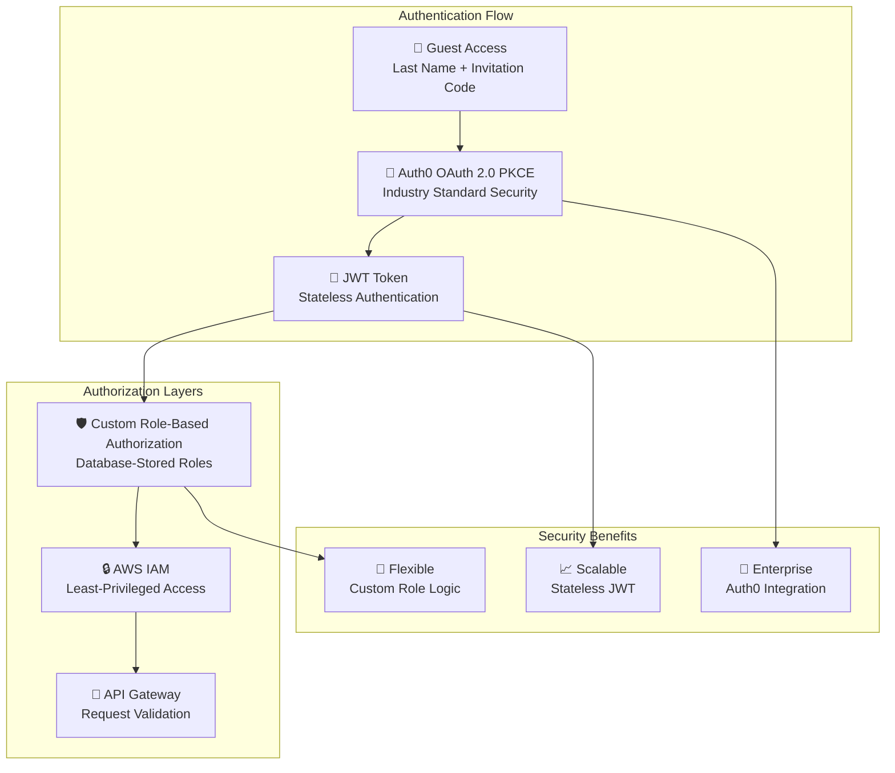
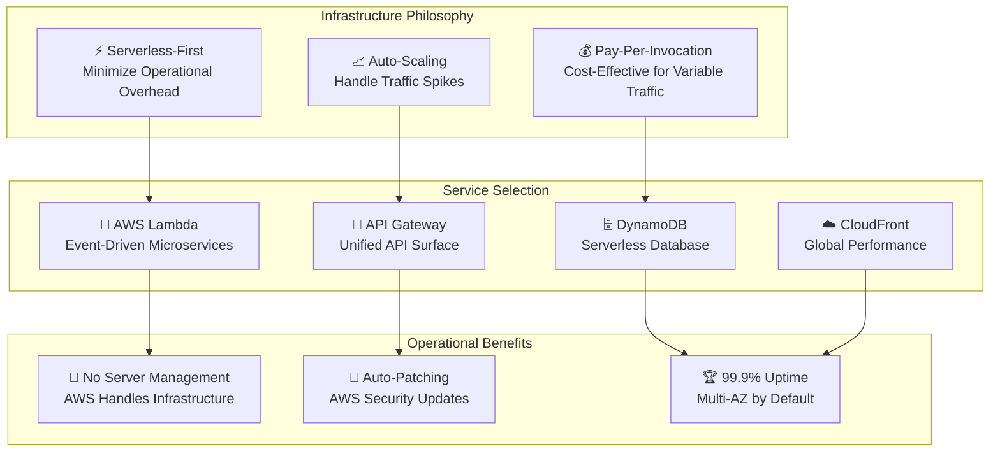
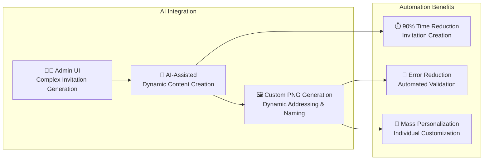
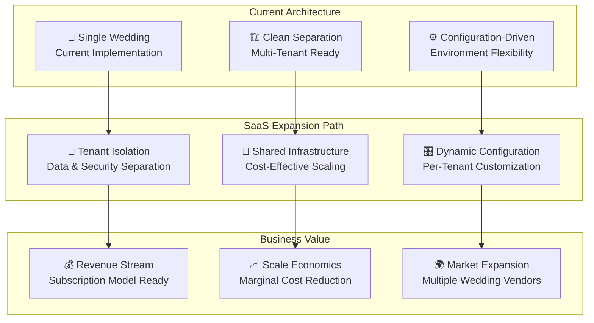
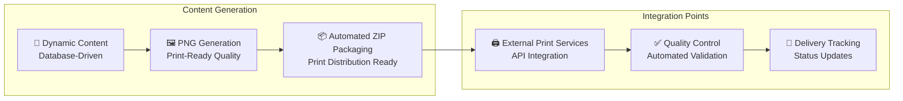

# Design Decisions & Architecture Rationale

## 🎯 Project Context & Constraints

### Timeline & Business Requirements
- **Critical Timeline**: Dec 2024 → July 2025 wedding
- **Key Milestones**: Save-the-dates by March 2025, RSVPs by May 18, 2025
- **Functional Requirements**: Guest management, RSVP system, custom invitation generation, wedding details, stats dashboard
- **Future Vision**: Multi-tenant SaaS expansion capability

### Success Criteria
- **Uptime Target**: 99.9% availability during critical periods
- **Performance Target**: <200ms API response times globally
- **Scale Target**: Support for multiple wedding clients (SaaS readiness)
- **Security Target**: Enterprise-grade security with multi-layered protection

---

## 🏗️ Core Architecture Decisions

### 1. Authentication & Authorization Strategy

**Decision Rationale:**
- **Auth0 Choice**: Industry-standard OAuth 2.0 PKCE for enterprise-grade security without building custom auth
- **Custom Roles**: Database-stored roles enable complex wedding-specific permissions (family admin, guest, etc.)
- **Guest Access Pattern**: Last name + invitation code provides familiar, non-technical entry point
- **Multi-layered Security**: Auth0 → JWT → Custom Authorization → IAM provides defense in depth

### 2. Serverless Infrastructure Strategy

**Decision Rationale:**
- **Serverless Adoption**: Reduces operational complexity under tight timeline constraints
- **Lambda per Endpoint**: Microservices pattern enables independent deployment and scaling
- **Cost Optimization**: Pay-per-invocation model ideal for wedding traffic patterns (spikes around deadlines)
- **Built-in Reliability**: AWS-managed services provide 99.9% uptime with multi-AZ deployment

### 3. Data Architecture & Performance Strategy

```mermaid
graph TB
    subgraph "DynamoDB Design"
        SingleTable[🗄️ Single-Table Design<br/>Optimized Query Patterns]
        GSIIndexes[📊 Global Secondary Indexes<br/>Multiple Access Patterns]
        DeletionProtection[🛡️ Deletion Protection<br/>Production Data Safety]
    end
    
    subgraph "Caching Strategy"
        CloudFrontCDN[☁️ CloudFront CDN<br/>Global Edge Caching]
        BackendCache[⚡ Backend Caching<br/>Infrequently-Changed Data]
        ReactQueryCache[📱 Frontend Cache<br/>Client-Side State Management]
    end
    
    subgraph "Performance Optimizations"
        WarmBoot[🔥 Lambda Warm Boot<br/>Critical Endpoint Optimization]
        IntelligentCaching[🧠 Intelligent Caching<br/>Data-Driven TTL Strategy]
        AutoBackups[💾 Automated Backups<br/>Point-in-Time Recovery]
    end
    
    SingleTable --> GSIIndexes
    GSIIndexes --> DeletionProtection
    
    CloudFrontCDN --> BackendCache
    BackendCache --> ReactQueryCache
    
    WarmBoot --> IntelligentCaching
    IntelligentCaching --> AutoBackups
```

**Decision Rationale:**
- **Single-Table DynamoDB**: Optimizes for query performance and reduces complexity
- **GSI Strategy**: Enables multiple access patterns without table scanning
- **Multi-Layer Caching**: CDN (static) → Backend (data) → Frontend (state) for <200ms response times
- **Warm Boot Strategy**: Pre-warmed Lambda functions for critical RSVP submission endpoints

### 4. Development & Operations Excellence

```mermaid
graph TB
    subgraph "Development Quality"
        TDD[🧪 Test-Driven Development<br/>400+ Unit Tests with NUnit/Moq]
        TypeSafety[🔒 TypeScript<br/>Compile-Time Error Prevention]
        LocalDev[🏠 Tilt Local Environment<br/>Full-Stack Development]
    end
    
    subgraph "Infrastructure as Code"
        CDKTypescript[📝 CDK with TypeScript<br/>Type-Safe Infrastructure]
        EnvironmentSeparation[🌍 Environment Separation<br/>Local/Dev/Prod Isolation]
        GitHubActions[🔄 GitHub Actions CI/CD<br/>Automated Pipeline]
    end
    
    subgraph "Monitoring & Observability"
        StructuredLogging[📊 Structured Logging<br/>CloudWatch Integration]
        BlueGreenDeploy[🔄 Blue/Green Deployments<br/>Zero-Downtime Updates]
        ComprehensiveMonitoring[📈 Comprehensive Monitoring<br/>Business & Technical Metrics]
    end
    
    TDD --> TypeSafety
    TypeSafety --> LocalDev
    
    CDKTypescript --> EnvironmentSeparation
    EnvironmentSeparation --> GitHubActions
    
    StructuredLogging --> BlueGreenDeploy
    BlueGreenDeploy --> ComprehensiveMonitoring
```

**Decision Rationale:**
- **TDD Approach**: 400+ unit tests ensure reliability under tight timeline pressure
- **Infrastructure as Code**: CDK with TypeScript provides type safety and version control
- **Environment Strategy**: Complete isolation prevents production issues during development
- **Zero-Downtime Deployments**: Blue/green deployment strategy maintains 99.9% uptime target

---

## 🎯 Special Features & Innovations

### 1. AI-Assisted Admin Interface

### 2. Multi-Tenant SaaS Architecture

### 3. Print Integration & Distribution

---

## 📊 Technical Specifications & Metrics

### Performance Characteristics
- **API Response Times**: <200ms global average
- **CDN Cache Hit Ratio**: >95% for static assets
- **Lambda Cold Start**: <500ms with warm boot optimization
- **Database Query Performance**: <50ms average DynamoDB response

### Scalability Metrics
- **Concurrent Users**: 1000+ simultaneous RSVP submissions
- **API Throughput**: 10,000+ requests/minute during peak traffic
- **Storage Capacity**: Unlimited with S3 and DynamoDB auto-scaling
- **Geographic Distribution**: Global via CloudFront edge locations

### Reliability & Security
- **Uptime Target**: 99.9% availability (8.77 hours downtime/year max)
- **Security Layers**: 5-layer security (Auth0, JWT, IAM, API Gateway, Encryption)
- **Backup Strategy**: Point-in-time DynamoDB recovery + cross-region replication
- **Disaster Recovery**: <1 hour RTO, <15 minutes RPO

### Cost Optimization
- **Pay-Per-Use Model**: Only pay for actual usage (invocations, storage, bandwidth)
- **Reserved Capacity**: Strategic DynamoDB reserved capacity for predictable workloads
- **Resource Right-Sizing**: Lambda memory optimization based on performance profiling
- **Cache Strategy**: Aggressive caching reduces backend calls by 80%

---

## 🎯 Engineering Best Practices

### 1. **Systems Design at Scale**
- Microservices architecture with clear domain boundaries
- Event-driven design for loose coupling
- CQRS pattern for optimal read/write performance
- Circuit breaker pattern for external service failures

### 2. **Operational Excellence**
- Infrastructure as Code (IaC) with AWS CDK
- Comprehensive monitoring and alerting
- Structured logging with correlation IDs
- Blue/green deployments with automated rollback

### 3. **Security-First Approach**
- Zero-trust security model
- Multi-layer defense strategy
- Secrets management with AWS Parameter Store
- Regular security audits and penetration testing

### 4. **Performance Engineering**
- Load testing and capacity planning
- Performance budgets and monitoring
- Caching strategy optimization
- Database query optimization with explain plans

### 5. **Quality Assurance**
- Test-Driven Development (TDD)
- 400+ unit tests with high coverage
- Integration testing with real AWS services
- End-to-end testing with Playwright

This architecture was deliberately designed to scale at an enterprise level, while delivering under aggressive timeline constraints, showcasing the ability to make pragmatic technical decisions that balance immediate needs with long-term scalability and maintainability.