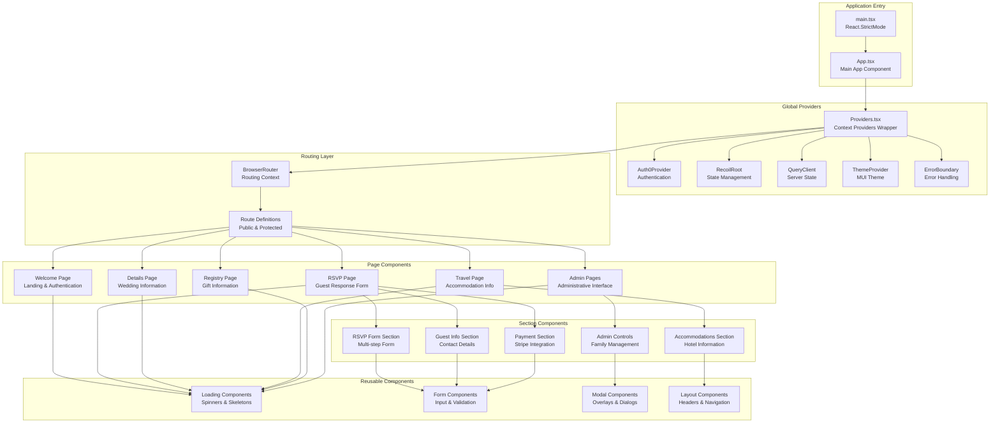
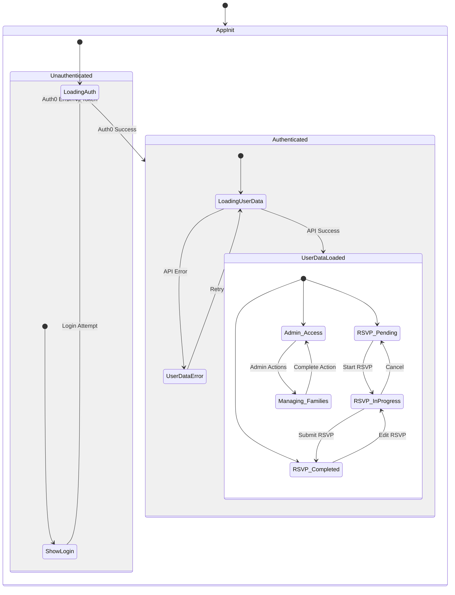
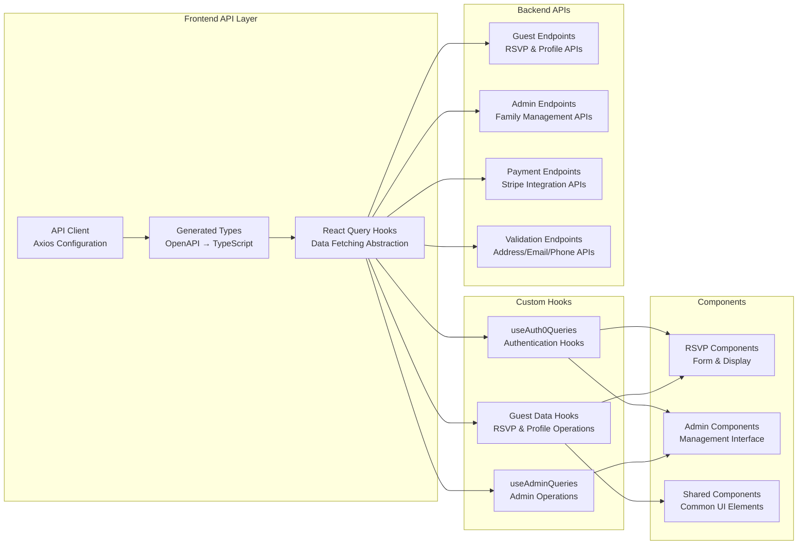
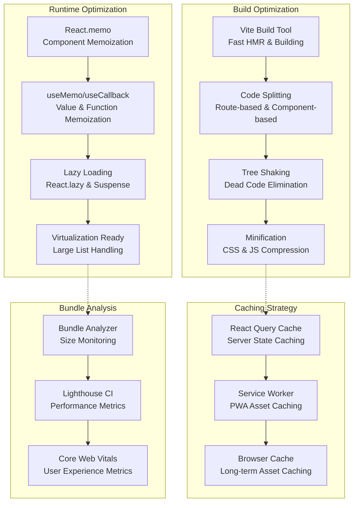

# Frontend Architecture

## React Application Structure

```mermaid
graph TB
    subgraph "Application Root"
        App[App.tsx<br/>Main Application Component]
        Root[Root.tsx<br/>Provider Wrapper]
    end
    
    subgraph "Routing & Navigation"
        Router[React Router DOM<br/>Route Configuration]
        Routes[Route Definitions<br/>Public/Protected Routes]
    end
    
    subgraph "State Management"
        Recoil[Recoil State<br/>Global Application State]
        ReactQuery[TanStack React Query<br/>Server State & Caching]
        LocalState[Component Local State<br/>useState/useReducer]
    end
    
    subgraph "Authentication"
        Auth0Provider[Auth0 React Provider<br/>Authentication Context]
        AuthHooks[Custom Auth Hooks<br/>useAuth0Utils]
        AuthGuards[Route Protection<br/>PrivateRoute Components]
    end
    
    subgraph "UI Components"
        Pages[📄 Pages<br/>Route-based Components]
        Sections[📋 Sections<br/>Page Section Components]
        Components[🧩 Components<br/>Reusable UI Elements]
        MUI[Material-UI (Joy)<br/>Design System]
    end
    
    subgraph "Business Logic"
        Hooks[Custom Hooks<br/>Business Logic Abstraction]
        API[API Layer<br/>HTTP Client & Types]
        Utils[Utilities<br/>Helper Functions]
    end
    
    subgraph "Theme & Styling"
        ThemeProvider[MUI Theme Provider<br/>Design Tokens]
        StyledComponents[Styled Components<br/>Component-specific Styles]
        ResponsiveDesign[Responsive Design<br/>Mobile-first Approach]
    end
    
    Root --> App
    App --> Router
    App --> Auth0Provider
    App --> Recoil
    App --> ReactQuery
    App --> ThemeProvider
    
    Router --> Routes
    Routes --> Pages
    Pages --> Sections
    Sections --> Components
    Components --> MUI
    
    Auth0Provider --> AuthHooks
    AuthHooks --> AuthGuards
    AuthGuards --> Pages
    
    Pages --> Hooks
    Sections --> Hooks
    Components --> Hooks
    Hooks --> API
    Hooks --> Utils
    
    Recoil --> LocalState
    ReactQuery --> API
    
    ThemeProvider --> StyledComponents
    StyledComponents --> ResponsiveDesign
    MUI --> ResponsiveDesign
    
    classDef appClass fill:#e1f5fe
    classDef routingClass fill:#f3e5f5
    classDef stateClass fill:#e8f5e8
    classDef authClass fill:#fff3e0
    classDef uiClass fill:#fce4ec
    classDef logicClass fill:#f1f8e9
    classDef themeClass fill:#f0f4c3
    
    class App,Root appClass
    class Router,Routes routingClass
    class Recoil,ReactQuery,LocalState stateClass
    class Auth0Provider,AuthHooks,AuthGuards authClass
    class Pages,Sections,Components,MUI uiClass
    class Hooks,API,Utils logicClass
    class ThemeProvider,StyledComponents,ResponsiveDesign themeClass
```

## Component Hierarchy & Data Flow



## State Management Flow



## API Integration Architecture



## Responsive Design Strategy

```mermaid
graph TD
    subgraph "Breakpoint Strategy"
        Mobile[📱 Mobile First<br/>Base Styles<br/>0px - 600px]
        Tablet[📊 Tablet<br/>theme.breakpoints.up('sm')<br/>600px - 960px]
        Desktop[🖥️ Desktop<br/>theme.breakpoints.up('md')<br/>960px - 1280px]
        LargeDesktop[🖥️ Large Desktop<br/>theme.breakpoints.up('lg')<br/>1280px+]
    end
    
    subgraph "Component Adaptation"
        Navigation[Navigation<br/>Drawer → Tabs → Header]
        Forms[Forms<br/>Stacked → Side-by-side]
        Cards[Cards<br/>Full Width → Grid]
        Modals[Modals<br/>Full Screen → Centered]
    end
    
    subgraph "Layout Systems"
        MUIGrid[MUI Grid System<br/>12-column Responsive]
        Flexbox[Flexbox Layout<br/>Direction & Wrap]
        Container[Container Component<br/>Max-width Control]
    end
    
    Mobile --> Tablet
    Tablet --> Desktop
    Desktop --> LargeDesktop
    
    Mobile --> Navigation
    Mobile --> Forms
    Mobile --> Cards
    Mobile --> Modals
    
    Navigation --> MUIGrid
    Forms --> MUIGrid
    Cards --> Flexbox
    Modals --> Container
```

## Performance Optimization

