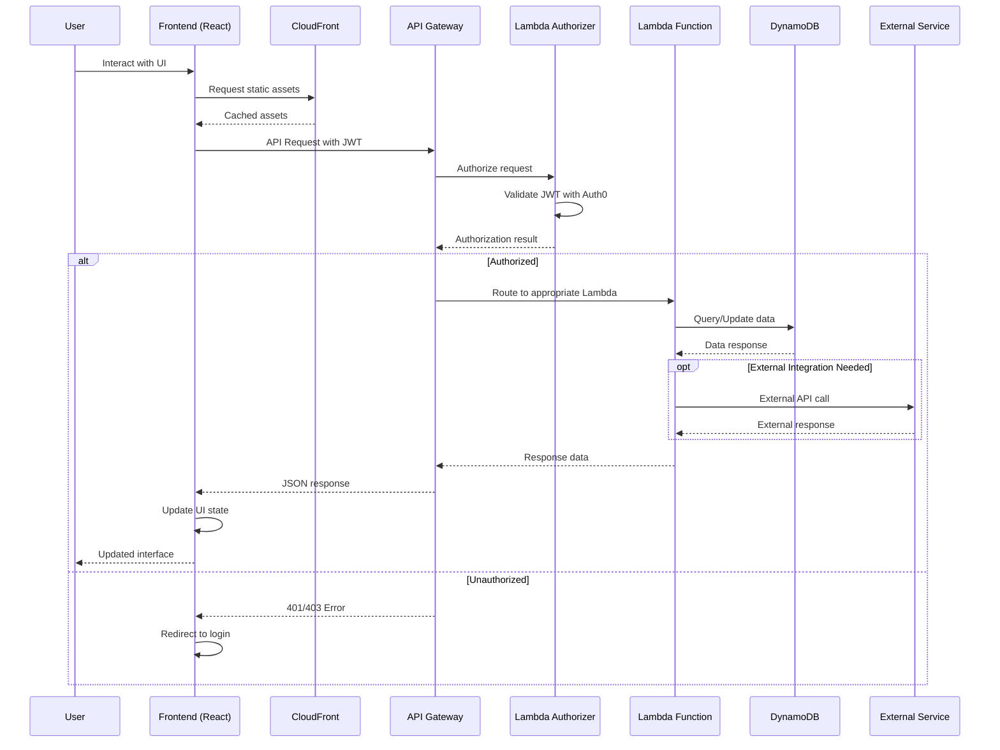
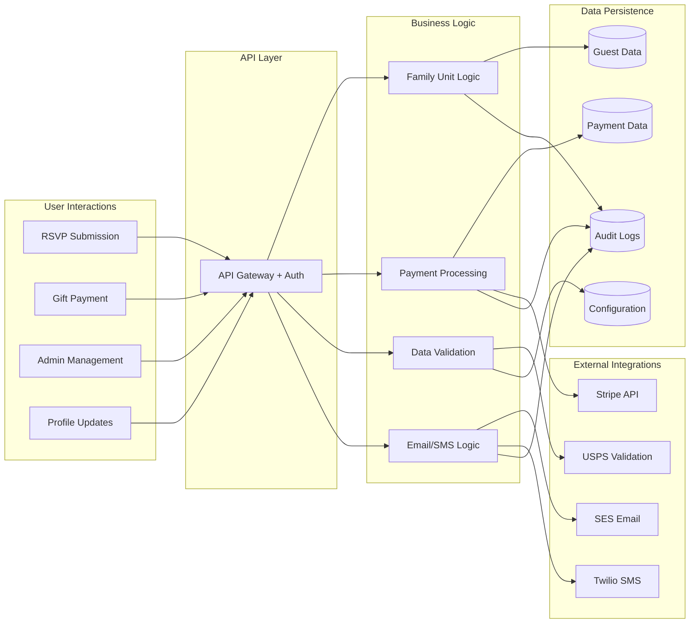

# System Overview Diagram

## High-Level System Architecture

```mermaid
graph TB
    User[👤 Wedding Guests/Admin]
    
    subgraph "Frontend Layer"
        WebApp[React PWA<br/>TypeScript, MUI]
        Mobile[📱 Mobile View]
        Desktop[🖥️ Desktop View]
    end
    
    subgraph "CDN & Hosting"
        CloudFront[☁️ CloudFront CDN]
        S3Web[🪣 S3 Static Hosting]
    end
    
    subgraph "API Gateway"
        ApiGW[🚪 API Gateway v2<br/>HTTP API]
        Auth[🔐 Lambda Authorizer<br/>Auth0 Integration]
    end
    
    subgraph "Lambda Functions"
        AdminLambdas[👨‍💼 Admin Functions<br/>- Family Management<br/>- Configuration<br/>- Setup]
        GuestLambdas[👤 Guest Functions<br/>- RSVP Management<br/>- Profile Updates<br/>- Data Retrieval]
        PaymentLambdas[💳 Payment Functions<br/>- Stripe Integration<br/>- Gift Processing<br/>- Webhooks]
        ValidationLambdas[✅ Validation Functions<br/>- Address Validation<br/>- Email/Phone Verify<br/>- Data Validation]
        NotificationLambdas[📧 Notification Functions<br/>- Email Sending<br/>- SMS Integration<br/>- Campaign Management]
    end
    
    subgraph "Data Layer"
        DynamoDB[(🗄️ DynamoDB)]
        GuestTable[Guest & Family Data]
        DesignTable[Design Configuration]
        PaymentTable[Payment Records]
        EmailTable[Email Tracking]
    end
    
    subgraph "External Services"
        Auth0[🔑 Auth0<br/>Authentication]
        Stripe[💰 Stripe<br/>Payments]
        SES[📧 Amazon SES<br/>Email Service]
        Twilio[📱 Twilio<br/>SMS Service]
        USPS[📮 USPS API<br/>Address Validation]
    end
    
    subgraph "Infrastructure"
        Route53[🌐 Route 53<br/>DNS]
        ACM[🔒 Certificate Manager<br/>SSL/TLS]
        SSM[⚙️ Systems Manager<br/>Parameters]
        IAM[🛡️ IAM<br/>Access Control]
    end
    
    User --> WebApp
    WebApp --> Mobile
    WebApp --> Desktop
    
    WebApp --> CloudFront
    CloudFront --> S3Web
    
    WebApp --> ApiGW
    ApiGW --> Auth
    Auth --> Auth0
    
    ApiGW --> AdminLambdas
    ApiGW --> GuestLambdas  
    ApiGW --> PaymentLambdas
    ApiGW --> ValidationLambdas
    ApiGW --> NotificationLambdas
    
    AdminLambdas --> DynamoDB
    GuestLambdas --> DynamoDB
    PaymentLambdas --> DynamoDB
    ValidationLambdas --> DynamoDB
    NotificationLambdas --> DynamoDB
    
    DynamoDB --> GuestTable
    DynamoDB --> DesignTable
    DynamoDB --> PaymentTable
    DynamoDB --> EmailTable
    
    PaymentLambdas --> Stripe
    ValidationLambdas --> USPS
    NotificationLambdas --> SES
    NotificationLambdas --> Twilio
    
    CloudFront --> Route53
    ApiGW --> Route53
    Route53 --> ACM
    
    AdminLambdas --> SSM
    GuestLambdas --> SSM
    PaymentLambdas --> SSM
    ValidationLambdas --> SSM
    NotificationLambdas --> SSM
    
    AdminLambdas -.-> IAM
    GuestLambdas -.-> IAM  
    PaymentLambdas -.-> IAM
    ValidationLambdas -.-> IAM
    NotificationLambdas -.-> IAM
    
    classDef userClass fill:#e1f5fe
    classDef frontendClass fill:#f3e5f5
    classDef infraClass fill:#e8f5e8
    classDef lambdaClass fill:#fff3e0
    classDef dataClass fill:#fce4ec
    classDef externalClass fill:#f1f8e9
    
    class User userClass
    class WebApp,Mobile,Desktop frontendClass
    class CloudFront,S3Web,ApiGW,Auth,Route53,ACM,SSM,IAM infraClass
    class AdminLambdas,GuestLambdas,PaymentLambdas,ValidationLambdas,NotificationLambdas lambdaClass
    class DynamoDB,GuestTable,DesignTable,PaymentTable,EmailTable dataClass
    class Auth0,Stripe,SES,Twilio,USPS externalClass
```

## Component Interaction Flow

```mermaid
sequenceDiagram
    participant U as User
    participant F as Frontend (React)
    participant CF as CloudFront
    participant AG as API Gateway  
    participant LA as Lambda Authorizer
    participant LF as Lambda Function
    participant DB as DynamoDB
    participant ES as External Service
    
    U->>F: Interact with UI
    F->>CF: Request static assets
    CF-->>F: Cached assets
    
    F->>AG: API Request with JWT
    AG->>LA: Authorize request
    LA->>LA: Validate JWT with Auth0
    LA-->>AG: Authorization result
    
    alt Authorized
        AG->>LF: Route to appropriate Lambda
        LF->>DB: Query/Update data
        DB-->>LF: Data response
        
        opt External Integration Needed
            LF->>ES: External API call
            ES-->>LF: External response
        end
        
        LF-->>AG: Response data
        AG-->>F: JSON response
        F->>F: Update UI state
        F-->>U: Updated interface
    else Unauthorized
        AG-->>F: 401/403 Error
        F->>F: Redirect to login
    end
```

## Data Flow Architecture

```mermaid
graph LR
    subgraph "User Interactions"
        RSVP[RSVP Submission]
        Payment[Gift Payment]
        Admin[Admin Management]
        Profile[Profile Updates]
    end
    
    subgraph "API Layer"
        GatewayAuth[API Gateway + Auth]
    end
    
    subgraph "Business Logic"
        FamilyLogic[Family Unit Logic]
        PaymentLogic[Payment Processing]
        ValidationLogic[Data Validation]
        NotificationLogic[Email/SMS Logic]
    end
    
    subgraph "Data Persistence"
        GuestData[(Guest Data)]
        PaymentData[(Payment Data)]
        ConfigData[(Configuration)]
        AuditData[(Audit Logs)]
    end
    
    subgraph "External Integrations"
        StripeAPI[Stripe API]
        EmailService[SES Email]
        SMSService[Twilio SMS]
        AddressAPI[USPS Validation]
    end
    
    RSVP --> GatewayAuth
    Payment --> GatewayAuth
    Admin --> GatewayAuth
    Profile --> GatewayAuth
    
    GatewayAuth --> FamilyLogic
    GatewayAuth --> PaymentLogic
    GatewayAuth --> ValidationLogic
    GatewayAuth --> NotificationLogic
    
    FamilyLogic --> GuestData
    PaymentLogic --> PaymentData
    PaymentLogic --> StripeAPI
    ValidationLogic --> AddressAPI
    NotificationLogic --> EmailService
    NotificationLogic --> SMSService
    
    FamilyLogic --> AuditData
    PaymentLogic --> AuditData
    ValidationLogic --> ConfigData
    NotificationLogic --> AuditData
```